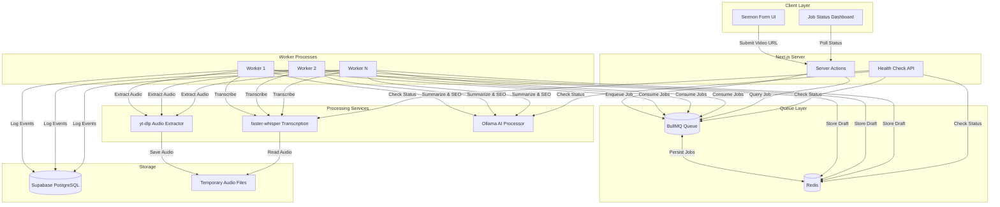
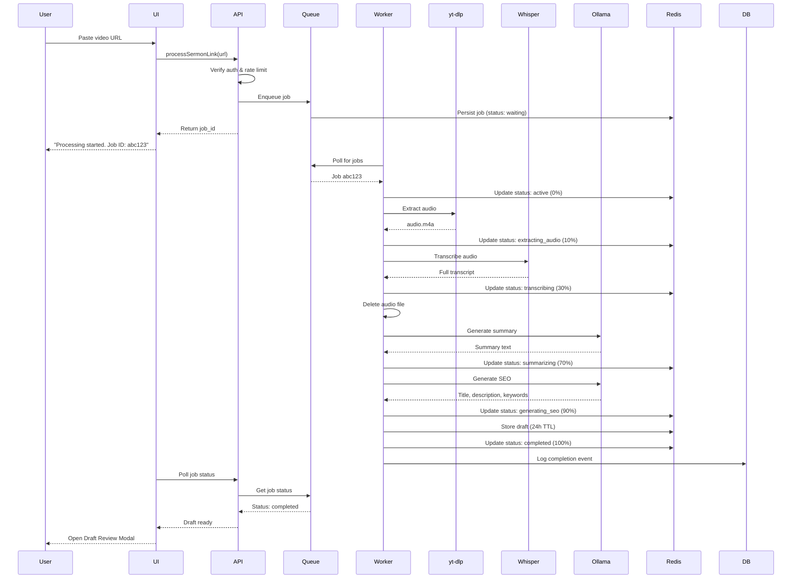
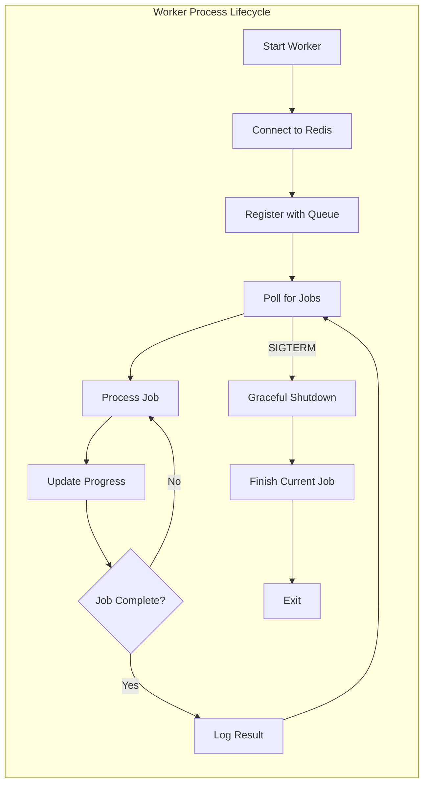

# Design Document — Sermon Queue Processor

## Overview

The Sermon Queue Processor is a production-ready, queue-based sermon processing system that transforms the existing synchronous sermon-ai-link-processor into an asynchronous, fault-tolerant, and horizontally scalable architecture. This system addresses critical limitations: dependency on the unreliable Gemini API, restriction to YouTube videos with captions, and blocking synchronous processing that degrades user experience.

The system enables asynchronous processing of ANY video (not just captioned YouTube videos) using free, self-hosted AI services. It provides real-time progress updates, automatic retry logic, horizontal scalability, and comprehensive error recovery—all while maintaining seamless integration with the existing sermon management workflow.

### Key Design Principles

1. **Asynchronous-First Architecture**: All processing happens in background workers, never blocking the web server or user interface
2. **Platform-Agnostic Video Support**: Process videos from YouTube, Vimeo, Facebook, Instagram, TikTok, and 1000+ platforms via yt-dlp
3. **Self-Hosted AI Stack**: No dependency on paid external APIs—uses Ollama (Mistral/Llama) for AI processing and faster-whisper for transcription
4. **Fault Tolerance**: Automatic retries with exponential backoff, stalled job detection, and dead letter queue for manual investigation
5. **Horizontal Scalability**: Add more worker processes to linearly increase throughput without code changes
6. **Real-Time Progress Tracking**: Users see live updates as jobs progress through extraction, transcription, and AI processing stages
7. **Idempotency**: Processing the same video multiple times produces consistent results without side effects

### Architecture Comparison

**Before (sermon-ai-link-processor):**
```
User submits URL → Server Action blocks for 5-10 minutes → Returns draft or error
- Synchronous blocking
- YouTube-only with captions
- Gemini API dependency
- No progress updates
- No retry logic
- Single point of failure
```

**After (sermon-queue-processor):**
```
User submits URL → Job enqueued (instant) → Worker processes asynchronously → Draft ready
- Non-blocking (returns job ID immediately)
- Any video platform
- Self-hosted AI (Ollama + Whisper)
- Real-time progress updates
- Automatic retries
- Horizontally scalable
```

---

## Architecture

### High-Level System Diagram



### Processing Pipeline Flow



### Worker Process Architecture



---

## Components and Interfaces

### 1. Job Queue Service (`src/lib/services/job-queue.ts`)

Manages job lifecycle, enqueueing, status tracking, and deduplication.

```typescript
import { Queue, Worker, Job } from 'bullmq'
import { Redis } from 'ioredis'

interface SermonJobData {
  jobId: string
  userId: string
  videoUrl: string
  priority: 'high' | 'normal' | 'low'
  createdAt: string
}

interface SermonJobResult {
  draft: SermonDraft
  processingDuration: number
}

interface JobProgress {
  status: JobStatus
  percentage: number
  currentStep: string
  estimatedTimeRemaining?: number
}

type JobStatus = 
  | 'waiting'
  | 'active'
  | 'extracting_audio'
  | 'transcribing'
  | 'summarizing'
  | 'generating_seo'
  | 'completed'
  | 'failed'
  | 'stalled'

export class JobQueueService {
  private queue: Queue<SermonJobData, SermonJobResult>
  private redis: Redis
  
  constructor() {
    this.redis = new Redis(process.env.REDIS_URL!)
    this.queue = new Queue('sermon-processing', {
      connection: this.redis,
      defaultJobOptions: {
        attempts: 3,
        backoff: {
          type: 'exponential',
          delay: 60000, // 1 minute, then 5 min, then 15 min
        },
        removeOnComplete: {
          age: 7 * 24 * 60 * 60, // Keep for 7 days
          count: 1000,
        },
        removeOnFail: {
          age: 7 * 24 * 60 * 60,
        },
      },
    })
  }
  
  /**
   * Enqueue a new sermon processing job
   * Returns existing job ID if duplicate detected within 24 hours
   */
  async enqueueJob(
    userId: string,
    videoUrl: string,
    priority: 'high' | 'normal' | 'low' = 'normal'
  ): Promise<string> {
    // Check for duplicate job
    const deduplicationKey = this.generateDeduplicationKey(videoUrl)
    const existingJobId = await this.redis.get(`dedup:${deduplicationKey}`)
    
    if (existingJobId) {
      const existingJob = await this.queue.getJob(existingJobId)
      if (existingJob && !['failed'].includes(await existingJob.getState())) {
        return existingJobId
      }
    }
    
    // Create new job
    const job = await this.queue.add(
      'process-sermon',
      {
        jobId: '', // Will be set by BullMQ
        userId,
        videoUrl,
        priority,
        createdAt: new Date().toISOString(),
      },
      {
        priority: priority === 'high' ? 1 : priority === 'normal' ? 5 : 10,
      }
    )
    
    // Store deduplication key with 24-hour TTL
    await this.redis.setex(
      `dedup:${deduplicationKey}`,
      24 * 60 * 60,
      job.id!
    )
    
    return job.id!
  }
  
  /**
   * Get current job status and progress
   */
  async getJobStatus(jobId: string): Promise<JobProgress | null> {
    const job = await this.queue.getJob(jobId)
    if (!job) return null
    
    const state = await job.getState()
    const progress = job.progress as JobProgress
    
    return {
      status: state as JobStatus,
      percentage: progress?.percentage || 0,
      currentStep: progress?.currentStep || 'Waiting',
      estimatedTimeRemaining: progress?.estimatedTimeRemaining,
    }
  }
  
  /**
   * Get completed job draft from Redis
   */
  async getJobDraft(jobId: string): Promise<SermonDraft | null> {
    const draftJson = await this.redis.get(`draft:${jobId}`)
    if (!draftJson) return null
    return JSON.parse(draftJson)
  }
  
  /**
   * Cancel a waiting job
   */
  async cancelJob(jobId: string): Promise<boolean> {
    const job = await this.queue.getJob(jobId)
    if (!job) return false
    
    const state = await job.getState()
    if (state === 'waiting' || state === 'delayed') {
      await job.remove()
      return true
    }
    
    return false
  }
  
  /**
   * Generate deduplication key from video URL
   * Normalizes URL: removes query params (except video ID), lowercase, trim
   */
  private generateDeduplicationKey(videoUrl: string): string {
    const normalized = this.normalizeVideoUrl(videoUrl)
    return crypto.createHash('sha256').update(normalized).digest('hex')
  }
  
  private normalizeVideoUrl(url: string): string {
    try {
      const parsed = new URL(url)
      
      // For YouTube, keep only the video ID
      if (parsed.hostname.includes('youtube.com') || parsed.hostname.includes('youtu.be')) {
        const videoId = parsed.searchParams.get('v') || parsed.pathname.split('/').pop()
        return `youtube:${videoId}`.toLowerCase()
      }
      
      // For other platforms, use normalized hostname + pathname
      return `${parsed.hostname}${parsed.pathname}`.toLowerCase().trim()
    } catch {
      return url.toLowerCase().trim()
    }
  }
}
```

### 2. Worker Process (`src/workers/sermon-processor.ts`)

Separate Node.js process that consumes jobs and executes processing steps.

```typescript
import { Worker, Job } from 'bullmq'
import { Redis } from 'ioredis'
import { AudioExtractor } from '../lib/services/audio-extractor'
import { TranscriptionService } from '../lib/services/transcription-service'
import { OllamaAIService } from '../lib/services/ollama-ai-service'
import { logProcessingEvent } from '../lib/services/processing-log'

const redis = new Redis(process.env.REDIS_URL!)

const worker = new Worker<SermonJobData, SermonJobResult>(
  'sermon-processing',
  async (job: Job<SermonJobData>) => {
    const startTime = Date.now()
    
    try {
      // Step 1: Extract audio (10%)
      await job.updateProgress({
        status: 'extracting_audio',
        percentage: 10,
        currentStep: 'Extracting audio from video...',
      })
      
      const audioPath = await AudioExtractor.extractAudio(
        job.data.videoUrl,
        job.id!
      )
      
      // Step 2: Transcribe audio (30%)
      await job.updateProgress({
        status: 'transcribing',
        percentage: 30,
        currentStep: 'Transcribing audio to text...',
      })
      
      const transcript = await TranscriptionService.transcribe(
        audioPath,
        (progress) => {
          job.updateProgress({
            status: 'transcribing',
            percentage: 30 + (progress * 0.4), // 30% to 70%
            currentStep: `Transcribing audio... ${Math.round(progress * 100)}%`,
          })
        }
      )
      
      // Clean up audio file
      await AudioExtractor.deleteAudioFile(audioPath)
      
      // Step 3: Generate summary (70%)
      await job.updateProgress({
        status: 'summarizing',
        percentage: 70,
        currentStep: 'Generating sermon summary...',
      })
      
      const summary = await OllamaAIService.generateSummary(transcript)
      
      // Step 4: Generate SEO (90%)
      await job.updateProgress({
        status: 'generating_seo',
        percentage: 90,
        currentStep: 'Optimizing for SEO...',
      })
      
      const seo = await OllamaAIService.generateSEO(transcript, summary)
      
      // Step 5: Store draft in Redis with 24-hour TTL
      const draft: SermonDraft = {
        title: seo.title,
        description: seo.description,
        content: summary,
        keywords: seo.keywords,
        video_url: job.data.videoUrl,
        transcript,
      }
      
      await redis.setex(
        `draft:${job.id}`,
        24 * 60 * 60,
        JSON.stringify(draft)
      )
      
      // Step 6: Mark complete (100%)
      await job.updateProgress({
        status: 'completed',
        percentage: 100,
        currentStep: 'Processing complete!',
      })
      
      const duration = Date.now() - startTime
      
      // Log success
      await logProcessingEvent({
        jobId: job.id!,
        userId: job.data.userId,
        videoUrl: job.data.videoUrl,
        status: 'completed',
        duration,
      })
      
      return { draft, processingDuration: duration }
    } catch (error) {
      const duration = Date.now() - startTime
      
      // Log failure
      await logProcessingEvent({
        jobId: job.id!,
        userId: job.data.userId,
        videoUrl: job.data.videoUrl,
        status: 'failed',
        errorMessage: error.message,
        duration,
      })
      
      throw error
    }
  },
  {
    connection: redis,
    concurrency: parseInt(process.env.WORKER_CONCURRENCY || '1'),
    lockDuration: 60 * 60 * 1000, // 60 minutes
    stalledInterval: 60 * 1000, // Check for stalled jobs every 1 minute
  }
)

// Graceful shutdown
process.on('SIGTERM', async () => {
  console.log('SIGTERM received. Gracefully shutting down...')
  await worker.close()
  process.exit(0)
})

process.on('SIGINT', async () => {
  console.log('SIGINT received. Gracefully shutting down...')
  await worker.close()
  process.exit(0)
})

worker.on('completed', (job) => {
  console.log(`Job ${job.id} completed successfully`)
})

worker.on('failed', (job, err) => {
  console.error(`Job ${job?.id} failed:`, err.message)
})

worker.on('stalled', (jobId) => {
  console.warn(`Job ${jobId} stalled. Will retry...`)
})

console.log('Sermon processor worker started')
```

### 3. Audio Extraction Service (`src/lib/services/audio-extractor.ts`)

Wraps yt-dlp for downloading audio from video URLs.

```typescript
import { exec } from 'child_process'
import { promisify } from 'util'
import { unlink } from 'fs/promises'
import path from 'path'

const execAsync = promisify(exec)

export class AudioExtractor {
  private static readonly TEMP_DIR = process.env.TEMP_AUDIO_DIR || '/tmp/sermon-audio'
  private static readonly MAX_DURATION_HOURS = 3
  private static readonly TIMEOUT_MS = 10 * 60 * 1000 // 10 minutes
  
  /**
   * Extract audio from video URL using yt-dlp
   * Returns path to downloaded audio file
   */
  static async extractAudio(videoUrl: string, jobId: string): Promise<string> {
    const timestamp = Date.now()
    const outputPath = path.join(this.TEMP_DIR, `${jobId}_${timestamp}.m4a`)
    
    // yt-dlp command: extract best audio, convert to m4a
    const command = [
      'yt-dlp',
      '--extract-audio',
      '--audio-format', 'm4a',
      '--audio-quality', '0', // Best quality
      '--output', outputPath,
      '--no-playlist',
      '--max-filesize', '500M', // Prevent huge downloads
      `"${videoUrl}"`,
    ].join(' ')
    
    try {
      const { stdout, stderr } = await execAsync(command, {
        timeout: this.TIMEOUT_MS,
      })
      
      // Check if file was created
      const fs = await import('fs/promises')
      await fs.access(outputPath)
      
      // Validate duration
      await this.validateDuration(outputPath)
      
      return outputPath
    } catch (error) {
      // Clean up partial download
      try {
        await unlink(outputPath)
      } catch {}
      
      if (error.message.includes('timeout')) {
        throw new Error('Audio extraction timed out (max 10 minutes)')
      }
      
      if (error.message.includes('Private video')) {
        throw new Error('Video is private or unavailable')
      }
      
      if (error.message.includes('Video unavailable')) {
        throw new Error('Video not found or region-blocked')
      }
      
      throw new Error(`Failed to download audio: ${error.message}`)
    }
  }
  
  /**
   * Validate audio duration doesn't exceed maximum
   */
  private static async validateDuration(audioPath: string): Promise<void> {
    const command = `ffprobe -v error -show_entries format=duration -of default=noprint_wrappers=1:nokey=1 "${audioPath}"`
    
    try {
      const { stdout } = await execAsync(command)
      const durationSeconds = parseFloat(stdout.trim())
      const durationHours = durationSeconds / 3600
      
      if (durationHours > this.MAX_DURATION_HOURS) {
        throw new Error(`Video too long (${durationHours.toFixed(1)} hours, max ${this.MAX_DURATION_HOURS} hours)`)
      }
    } catch (error) {
      if (error.message.includes('Video too long')) {
        throw error
      }
      // If ffprobe fails, continue anyway (duration check is best-effort)
      console.warn('Could not validate audio duration:', error.message)
    }
  }
  
  /**
   * Delete temporary audio file
   */
  static async deleteAudioFile(audioPath: string): Promise<void> {
    try {
      await unlink(audioPath)
    } catch (error) {
      console.warn(`Failed to delete audio file ${audioPath}:`, error.message)
    }
  }
}
```

### 4. Transcription Service (`src/lib/services/transcription-service.ts`)

Wraps faster-whisper Python library for speech-to-text conversion.

```typescript
import { spawn } from 'child_process'
import path from 'path'

interface TranscriptSegment {
  start: number
  end: number
  text: string
}

export class TranscriptionService {
  private static readonly WHISPER_MODEL = process.env.WHISPER_MODEL || 'base'
  private static readonly TIMEOUT_MS = 30 * 60 * 1000 // 30 minutes
  private static readonly MIN_TRANSCRIPT_WORDS = 100
  
  /**
   * Transcribe audio file using faster-whisper
   * Calls Python script that uses faster-whisper library
   * Progress callback receives percentage (0-1)
   */
  static async transcribe(
    audioPath: string,
    onProgress?: (progress: number) => void
  ): Promise<string> {
    return new Promise((resolve, reject) => {
      const pythonScript = path.join(__dirname, '../../scripts/transcribe.py')
      
      const process = spawn('python3', [
        pythonScript,
        audioPath,
        this.WHISPER_MODEL,
      ])
      
      let stdout = ''
      let stderr = ''
      let lastProgress = 0
      
      const timeout = setTimeout(() => {
        process.kill()
        reject(new Error('Transcription timed out (max 30 minutes)'))
      }, this.TIMEOUT_MS)
      
      process.stdout.on('data', (data) => {
        const output = data.toString()
        stdout += output
        
        // Parse progress updates from Python script
        // Format: PROGRESS:0.45
        const progressMatch = output.match(/PROGRESS:([\d.]+)/)
        if (progressMatch && onProgress) {
          const progress = parseFloat(progressMatch[1])
          if (progress > lastProgress) {
            lastProgress = progress
            onProgress(progress)
          }
        }
      })
      
      process.stderr.on('data', (data) => {
        stderr += data.toString()
      })
      
      process.on('close', (code) => {
        clearTimeout(timeout)
        
        if (code !== 0) {
          reject(new Error(`Transcription failed: ${stderr}`))
          return
        }
        
        try {
          // Parse JSON output from Python script
          const result = JSON.parse(stdout)
          const transcript = this.formatTranscript(result.segments)
          
          // Validate transcript length
          const wordCount = transcript.split(/\s+/).length
          if (wordCount < this.MIN_TRANSCRIPT_WORDS) {
            reject(new Error(`Transcript too short (${wordCount} words, min ${this.MIN_TRANSCRIPT_WORDS} words)`))
            return
          }
          
          resolve(transcript)
        } catch (error) {
          reject(new Error(`Failed to parse transcription result: ${error.message}`))
        }
      })
      
      process.on('error', (error) => {
        clearTimeout(timeout)
        reject(new Error(`Failed to start transcription process: ${error.message}`))
      })
    })
  }
  
  /**
   * Format transcript segments into readable text
   */
  private static formatTranscript(segments: TranscriptSegment[]): string {
    return segments
      .map(segment => segment.text.trim())
      .join(' ')
      .replace(/\s+/g, ' ')
      .trim()
  }
}
```

### 5. Ollama AI Service (`src/lib/services/ollama-ai-service.ts`)

Integrates with self-hosted Ollama for AI summarization and SEO generation.

```typescript
import axios from 'axios'

interface OllamaResponse {
  response: string
  done: boolean
}

interface SEOContent {
  title: string
  description: string
  keywords: string[]
}

export class OllamaAIService {
  private static readonly OLLAMA_ENDPOINT = process.env.OLLAMA_ENDPOINT || 'http://localhost:11434'
  private static readonly MODEL = process.env.OLLAMA_MODEL || 'mistral'
  private static readonly SUMMARY_TIMEOUT_MS = 10 * 60 * 1000 // 10 minutes
  private static readonly SEO_TIMEOUT_MS = 5 * 60 * 1000 // 5 minutes
  
  /**
   * Generate comprehensive sermon summary using Ollama
   * Target: 1500+ words with themes, scripture, takeaways, structure
   */
  static async generateSummary(transcript: string): Promise<string> {
    const prompt = `You are a sermon content specialist. Analyze the following sermon transcript and create a comprehensive, detailed summary.

Requirements:
- Length: 1500+ words (this is a full sermon summary, not a brief overview)
- Include main themes and key theological points
- Mention all scripture references with context
- Highlight actionable takeaways and applications
- Describe the sermon structure and flow
- Use clear, engaging language suitable for a church website
- Maintain the sermon's tone and emphasis

Transcript:
${transcript}

Provide only the summary text, no additional commentary or meta-text.`
    
    try {
      const response = await axios.post(
        `${this.OLLAMA_ENDPOINT}/api/generate`,
        {
          model: this.MODEL,
          prompt,
          stream: false,
        },
        {
          timeout: this.SUMMARY_TIMEOUT_MS,
        }
      )
      
      const summary = response.data.response.trim()
      
      // Validate summary length
      const wordCount = summary.split(/\s+/).length
      if (wordCount < 100) {
        throw new Error(`Generated summary too short (${wordCount} words, min 100 words)`)
      }
      
      return summary
    } catch (error) {
      if (error.code === 'ECONNREFUSED') {
        throw new Error('AI service unavailable. Please ensure Ollama is running.')
      }
      
      if (error.message.includes('timeout')) {
        throw new Error('AI summarization timed out (max 10 minutes)')
      }
      
      throw new Error(`AI summarization failed: ${error.message}`)
    }
  }
  
  /**
   * Generate SEO-optimized metadata using Ollama
   */
  static async generateSEO(transcript: string, summary: string): Promise<SEOContent> {
    const prompt = `You are an SEO specialist for a church website. Based on the sermon content below, generate SEO-optimized metadata.

Summary:
${summary.slice(0, 2000)}

Transcript excerpt:
${transcript.slice(0, 3000)}

Generate the following in JSON format:
{
  "title": "SEO-optimized title (50-70 characters)",
  "description": "Meta description (150-160 characters)",
  "keywords": ["keyword1", "keyword2", "keyword3", "keyword4", "keyword5", "keyword6", "keyword7", "keyword8"]
}

Requirements:
- Title should be compelling and include main topic
- Description should entice clicks while summarizing content
- Keywords should be relevant search terms (5-8 keywords)
- Use natural language, avoid keyword stuffing

Respond with ONLY the JSON object, no additional text or markdown formatting.`
    
    try {
      const response = await axios.post(
        `${this.OLLAMA_ENDPOINT}/api/generate`,
        {
          model: this.MODEL,
          prompt,
          stream: false,
        },
        {
          timeout: this.SEO_TIMEOUT_MS,
        }
      )
      
      const responseText = response.data.response.trim()
      
      // Extract JSON from response (handle markdown code blocks)
      const jsonMatch = responseText.match(/\{[\s\S]*\}/)
      if (!jsonMatch) {
        throw new Error('Failed to parse SEO content from AI response')
      }
      
      const seo = JSON.parse(jsonMatch[0])
      
      // Validate response structure
      if (!seo.title || !seo.description || !Array.isArray(seo.keywords)) {
        throw new Error('Invalid SEO content structure')
      }
      
      // Validate constraints
      if (seo.title.length > 100) {
        throw new Error(`SEO title too long (${seo.title.length} chars, max 100 chars)`)
      }
      
      return seo
    } catch (error) {
      if (error.code === 'ECONNREFUSED') {
        throw new Error('AI service unavailable. Please ensure Ollama is running.')
      }
      
      if (error.message.includes('timeout')) {
        throw new Error('SEO generation timed out (max 5 minutes)')
      }
      
      throw new Error(`SEO generation failed: ${error.message}`)
    }
  }
}
```


### 6. Server Actions (`src/lib/actions/sermon-queue-processor.ts`)

Server actions for job management and status queries.

```typescript
'use server'

import { JobQueueService } from '../services/job-queue'
import { verifyRole } from '../auth/verify-role'
import { checkRateLimit } from '../services/rate-limiter'

const jobQueue = new JobQueueService()

export async function processSermonLink(url: string): Promise<{
  success?: boolean
  jobId?: string
  error?: string
}> {
  try {
    // 1. Verify user role (admin or editor only)
    const profile = await verifyRole(['admin', 'editor'])
    
    // 2. Check rate limit (10 jobs per hour)
    const canProcess = await checkRateLimit(profile.id, 10)
    if (!canProcess) {
      return {
        error: 'Rate limit exceeded. You can submit 10 videos per hour. Try again later.',
      }
    }
    
    // 3. Validate URL format
    if (!url || !url.trim()) {
      return { error: 'Please provide a valid video URL' }
    }
    
    // 4. Enqueue job (returns existing job ID if duplicate)
    const jobId = await jobQueue.enqueueJob(profile.id, url.trim())
    
    return {
      success: true,
      jobId,
    }
  } catch (error) {
    console.error('[processSermonLink]', error)
    return {
      error: 'Failed to start processing. Please try again.',
    }
  }
}

export async function getJobStatus(jobId: string): Promise<{
  success?: boolean
  status?: JobProgress
  error?: string
}> {
  try {
    const status = await jobQueue.getJobStatus(jobId)
    
    if (!status) {
      return { error: 'Job not found' }
    }
    
    return {
      success: true,
      status,
    }
  } catch (error) {
    console.error('[getJobStatus]', error)
    return {
      error: 'Failed to fetch job status',
    }
  }
}

export async function getJobDraft(jobId: string): Promise<{
  success?: boolean
  draft?: SermonDraft
  error?: string
}> {
  try {
    const draft = await jobQueue.getJobDraft(jobId)
    
    if (!draft) {
      return { error: 'Draft not found or expired' }
    }
    
    return {
      success: true,
      draft,
    }
  } catch (error) {
    console.error('[getJobDraft]', error)
    return {
      error: 'Failed to fetch draft',
    }
  }
}

export async function cancelJob(jobId: string): Promise<{
  success?: boolean
  error?: string
}> {
  try {
    const cancelled = await jobQueue.cancelJob(jobId)
    
    if (!cancelled) {
      return { error: 'Job cannot be cancelled (already processing or completed)' }
    }
    
    return { success: true }
  } catch (error) {
    console.error('[cancelJob]', error)
    return {
      error: 'Failed to cancel job',
    }
  }
}
```

### 7. UI Components

#### AI Link Processor with Queue Integration (`src/components/admin/sermons/ai-link-processor-queue.tsx`)

```typescript
'use client'

import { useState, useEffect } from 'react'
import { processSermonLink, getJobStatus, getJobDraft } from '@/lib/actions/sermon-queue-processor'

interface AILinkProcessorQueueProps {
  onDraftGenerated: (draft: SermonDraft) => void
}

export function AILinkProcessorQueue({ onDraftGenerated }: AILinkProcessorQueueProps) {
  const [linkUrl, setLinkUrl] = useState('')
  const [jobId, setJobId] = useState<string | null>(null)
  const [status, setStatus] = useState<JobProgress | null>(null)
  const [error, setError] = useState<string | null>(null)
  const [isProcessing, setIsProcessing] = useState(false)
  
  // Poll job status every 2 seconds while processing
  useEffect(() => {
    if (!jobId || !isProcessing) return
    
    const interval = setInterval(async () => {
      const result = await getJobStatus(jobId)
      
      if (result.error) {
        setError(result.error)
        setIsProcessing(false)
        return
      }
      
      setStatus(result.status!)
      
      // Check if completed
      if (result.status!.status === 'completed') {
        setIsProcessing(false)
        
        // Fetch draft
        const draftResult = await getJobDraft(jobId)
        if (draftResult.success && draftResult.draft) {
          onDraftGenerated(draftResult.draft)
          setLinkUrl('')
          setJobId(null)
          setStatus(null)
        }
      }
      
      // Check if failed
      if (result.status!.status === 'failed') {
        setIsProcessing(false)
        setError('Processing failed. Please try again or enter content manually.')
      }
    }, 2000)
    
    return () => clearInterval(interval)
  }, [jobId, isProcessing, onDraftGenerated])
  
  const handleProcess = async () => {
    setError(null)
    setStatus(null)
    
    const result = await processSermonLink(linkUrl)
    
    if (result.error) {
      setError(result.error)
      return
    }
    
    setJobId(result.jobId!)
    setIsProcessing(true)
  }
  
  const isValidUrl = linkUrl.trim().length > 0
  
  return (
    <div className="space-y-4">
      <div>
        <label htmlFor="video-url" className="block text-sm font-medium mb-2">
          Video URL
        </label>
        <input
          id="video-url"
          type="url"
          value={linkUrl}
          onChange={(e) => setLinkUrl(e.target.value)}
          disabled={isProcessing}
          placeholder="https://youtube.com/watch?v=..."
          className="w-full px-3 py-2 border rounded-md"
        />
      </div>
      
      {!isProcessing && (
        <button
          onClick={handleProcess}
          disabled={!isValidUrl}
          className="px-4 py-2 bg-blue-600 text-white rounded-md disabled:opacity-50"
        >
          Process Video
        </button>
      )}
      
      {isProcessing && status && (
        <div className="space-y-2" role="status" aria-live="polite">
          <div className="flex items-center justify-between">
            <span className="text-sm font-medium">{status.currentStep}</span>
            <span className="text-sm text-gray-600">{status.percentage}%</span>
          </div>
          <div className="w-full bg-gray-200 rounded-full h-2">
            <div
              className="bg-blue-600 h-2 rounded-full transition-all duration-300"
              style={{ width: `${status.percentage}%` }}
              aria-valuenow={status.percentage}
              aria-valuemin={0}
              aria-valuemax={100}
            />
          </div>
          {status.estimatedTimeRemaining && (
            <p className="text-sm text-gray-600">
              Estimated time remaining: {Math.ceil(status.estimatedTimeRemaining / 60)} minutes
            </p>
          )}
          <p className="text-xs text-gray-500">
            Job ID: {jobId} • You can navigate away and check back later
          </p>
        </div>
      )}
      
      {error && (
        <div className="p-3 bg-red-50 border border-red-200 rounded-md" role="alert" aria-live="assertive">
          <p className="text-sm text-red-800">
            <strong>Error:</strong> {error}
          </p>
        </div>
      )}
    </div>
  )
}
```

#### Job Status Dashboard (`src/app/admin/sermons/jobs/page.tsx`)

```typescript
'use client'

import { useState, useEffect } from 'react'
import { getUserJobs } from '@/lib/actions/sermon-queue-processor'

export default function JobStatusDashboard() {
  const [jobs, setJobs] = useState<JobInfo[]>([])
  const [filter, setFilter] = useState<'all' | 'waiting' | 'active' | 'completed' | 'failed'>('all')
  
  useEffect(() => {
    loadJobs()
    const interval = setInterval(loadJobs, 5000) // Refresh every 5 seconds
    return () => clearInterval(interval)
  }, [filter])
  
  const loadJobs = async () => {
    const result = await getUserJobs(filter)
    if (result.success) {
      setJobs(result.jobs!)
    }
  }
  
  return (
    <div className="space-y-6">
      <h1 className="text-2xl font-bold">Processing Jobs</h1>
      
      <div className="flex gap-2">
        {(['all', 'waiting', 'active', 'completed', 'failed'] as const).map((f) => (
          <button
            key={f}
            onClick={() => setFilter(f)}
            className={`px-4 py-2 rounded-md ${
              filter === f ? 'bg-blue-600 text-white' : 'bg-gray-200'
            }`}
          >
            {f.charAt(0).toUpperCase() + f.slice(1)}
          </button>
        ))}
      </div>
      
      <div className="overflow-x-auto">
        <table className="w-full border-collapse">
          <thead>
            <tr className="bg-gray-100">
              <th className="p-3 text-left">Video URL</th>
              <th className="p-3 text-left">Status</th>
              <th className="p-3 text-left">Progress</th>
              <th className="p-3 text-left">Submitted</th>
              <th className="p-3 text-left">Actions</th>
            </tr>
          </thead>
          <tbody>
            {jobs.map((job) => (
              <tr key={job.id} className="border-b">
                <td className="p-3">
                  <a href={job.videoUrl} target="_blank" rel="noopener noreferrer" className="text-blue-600 hover:underline">
                    {job.videoUrl.slice(0, 50)}...
                  </a>
                </td>
                <td className="p-3">
                  <span className={`px-2 py-1 rounded text-sm ${
                    job.status === 'completed' ? 'bg-green-100 text-green-800' :
                    job.status === 'failed' ? 'bg-red-100 text-red-800' :
                    job.status === 'active' ? 'bg-blue-100 text-blue-800' :
                    'bg-gray-100 text-gray-800'
                  }`}>
                    {job.status}
                  </span>
                </td>
                <td className="p-3">{job.progress}%</td>
                <td className="p-3">{new Date(job.createdAt).toLocaleString()}</td>
                <td className="p-3">
                  {job.status === 'completed' && (
                    <button className="text-blue-600 hover:underline">View Draft</button>
                  )}
                  {job.status === 'failed' && (
                    <button className="text-blue-600 hover:underline">Retry</button>
                  )}
                  {job.status === 'waiting' && (
                    <button className="text-red-600 hover:underline">Cancel</button>
                  )}
                </td>
              </tr>
            ))}
          </tbody>
        </table>
      </div>
    </div>
  )
}
```

---

## Data Models

### Database Schema

#### Extended `processing_logs` Table

```sql
-- Extend existing processing_logs table with queue-specific fields
ALTER TABLE processing_logs ADD COLUMN IF NOT EXISTS job_id TEXT;
ALTER TABLE processing_logs ADD COLUMN IF NOT EXISTS retry_count INTEGER DEFAULT 0;
ALTER TABLE processing_logs ADD COLUMN IF NOT EXISTS processing_step TEXT;

-- Index for job ID lookups
CREATE INDEX IF NOT EXISTS idx_processing_logs_job_id 
  ON processing_logs(job_id);
```

### Redis Data Structures

#### Job Data (Managed by BullMQ)

```typescript
// Stored in Redis by BullMQ
interface BullMQJob {
  id: string
  name: 'process-sermon'
  data: SermonJobData
  opts: {
    priority: number
    attempts: number
    backoff: {
      type: 'exponential'
      delay: number
    }
  }
  progress: JobProgress
  returnvalue: SermonJobResult | null
  stacktrace: string[] | null
  timestamp: number
  finishedOn: number | null
  processedOn: number | null
}
```

#### Draft Storage (Custom)

```typescript
// Key: draft:{jobId}
// TTL: 24 hours
// Value: JSON-serialized SermonDraft
interface SermonDraft {
  title: string
  description: string
  content: string
  keywords: string[]
  video_url: string
  transcript: string
}
```

#### Deduplication Keys (Custom)

```typescript
// Key: dedup:{sha256(normalized_url)}
// TTL: 24 hours
// Value: job_id
```

#### Rate Limit Counters (Custom)

```typescript
// Key: ratelimit:{userId}:{hour_timestamp}
// TTL: 1 hour
// Value: count (integer)
```

### TypeScript Interfaces

```typescript
// Core job data
interface SermonJobData {
  jobId: string
  userId: string
  videoUrl: string
  priority: 'high' | 'normal' | 'low'
  createdAt: string
}

// Job result
interface SermonJobResult {
  draft: SermonDraft
  processingDuration: number
}

// Job progress
interface JobProgress {
  status: JobStatus
  percentage: number
  currentStep: string
  estimatedTimeRemaining?: number
}

type JobStatus = 
  | 'waiting'
  | 'active'
  | 'extracting_audio'
  | 'transcribing'
  | 'summarizing'
  | 'generating_seo'
  | 'completed'
  | 'failed'
  | 'stalled'

// Sermon draft
interface SermonDraft {
  title: string
  description: string
  content: string
  keywords: string[]
  video_url: string
  transcript: string
}

// Job info for dashboard
interface JobInfo {
  id: string
  videoUrl: string
  status: JobStatus
  progress: number
  createdAt: string
  completedAt?: string
  errorMessage?: string
}
```

---

## Error Handling

### Error Categories and Recovery Strategies

| Error Type | User Message | Recovery Options | Retry Strategy |
|------------|--------------|------------------|----------------|
| Invalid URL | "Invalid URL format. Please provide a valid video URL." | Correct URL and retry | No retry (non-retryable) |
| Video unavailable | "Video is private, deleted, or unavailable. Try a different video." | Try different video | No retry (non-retryable) |
| Video too long | "Video too long (X hours, max 3 hours). Try a shorter video." | Try shorter video | No retry (non-retryable) |
| Audio extraction timeout | "Audio extraction timed out. Please try again." | Retry | Retry 3x with backoff |
| Transcription failed | "Transcription failed. Please try again or enter content manually." | Retry or manual entry | Retry 3x with backoff |
| Transcript too short | "Transcript too short (X words, min 100 words). Try a different video." | Try different video | No retry (non-retryable) |
| Ollama unavailable | "AI service unavailable. Please try again in a few minutes." | Retry later | Retry 3x with backoff |
| AI timeout | "AI processing timed out. Please try again." | Retry | Retry 3x with backoff |
| Rate limit exceeded | "Rate limit exceeded. You can submit 10 videos per hour. Try again in X minutes." | Wait or manual entry | No retry (non-retryable) |
| Disk space low | "Insufficient disk space. Try again later." | Wait | No retry (non-retryable) |
| Job stalled | "Processing stalled. Retrying automatically..." | Automatic retry | Retry 3x with backoff |

### Retry Logic

```typescript
// BullMQ retry configuration
{
  attempts: 3,
  backoff: {
    type: 'exponential',
    delay: 60000, // 1 minute base delay
  },
}

// Retry delays:
// Attempt 1: 1 minute
// Attempt 2: 5 minutes (exponential backoff)
// Attempt 3: 15 minutes (exponential backoff)
// After 3 attempts: Move to dead letter queue
```

### Error Classification

```typescript
function isRetryableError(error: Error): boolean {
  const retryablePatterns = [
    'timeout',
    'ECONNREFUSED',
    'ETIMEDOUT',
    'ENOTFOUND',
    'AI service unavailable',
    'Ollama unavailable',
    'Network error',
  ]
  
  return retryablePatterns.some(pattern => 
    error.message.toLowerCase().includes(pattern.toLowerCase())
  )
}

function classifyError(error: Error): 'retryable' | 'non-retryable' {
  if (isRetryableError(error)) {
    return 'retryable'
  }
  
  return 'non-retryable'
}
```

---

## Testing Strategy

### Unit Tests

Focus on pure functions and isolated logic:

1. **URL Normalization** (`job-queue.test.ts`)
   - Normalize YouTube URLs (remove query params except video ID)
   - Normalize other platform URLs (hostname + pathname)
   - Handle malformed URLs gracefully

2. **Deduplication Key Generation** (`job-queue.test.ts`)
   - Generate consistent keys for same video
   - Generate different keys for different videos
   - Handle URL variations (http vs https, www vs non-www)

3. **Error Classification** (`error-handler.test.ts`)
   - Classify retryable errors correctly
   - Classify non-retryable errors correctly
   - Handle unknown error types

4. **Rate Limit Calculation** (`rate-limiter.test.ts`)
   - Count requests within sliding window
   - Reset counter after window expires
   - Handle concurrent requests correctly

5. **Transcript Formatting** (`transcription-service.test.ts`)
   - Combine segments with proper spacing
   - Normalize whitespace
   - Handle empty segments

### Integration Tests

Test component interactions and external services:

1. **Job Enqueueing and Consumption**
   - Enqueue job and verify it appears in Redis
   - Worker consumes job and processes it
   - Job status updates correctly throughout lifecycle

2. **Deduplication Logic**
   - Submitting same URL twice returns same job ID
   - Submitting different URLs creates different jobs
   - Deduplication expires after 24 hours

3. **Rate Limiting**
   - Allow 10 jobs per hour per user
   - Block 11th job with appropriate error
   - Reset counter after 1 hour

4. **Retry Logic**
   - Failed job retries automatically
   - Retry count increments correctly
   - Job moves to dead letter queue after 3 failures

5. **Stalled Job Detection**
   - Worker crash causes job to be marked stalled
   - Stalled job retries automatically
   - Heartbeat prevents false stalled detection

6. **Audio Extraction** (with real yt-dlp, limited runs)
   - Extract audio from public YouTube video
   - Handle private video gracefully
   - Handle invalid URL gracefully

7. **Transcription** (with real faster-whisper, limited runs)
   - Transcribe sample audio file
   - Handle corrupted audio gracefully
   - Report progress correctly

8. **Ollama Integration** (with real Ollama, limited runs)
   - Generate summary from sample transcript
   - Generate SEO from sample transcript
   - Handle Ollama unavailable gracefully

### Property-Based Tests

I'll now use the prework tool to analyze acceptance criteria before writing correctness properties.


### Smoke Tests

1. **Infrastructure Dependencies**
   - BullMQ and Redis are configured and accessible
   - yt-dlp is installed and executable
   - faster-whisper Python library is installed
   - Ollama is running and accessible
   - Required environment variables are set

2. **Database Schema**
   - `processing_logs` table has required columns
   - Required indexes are present
   - RLS policies are active

---

## Correctness Properties

*A property is a characteristic or behavior that should hold true across all valid executions of a system—essentially, a formal statement about what the system should do. Properties serve as the bridge between human-readable specifications and machine-verifiable correctness guarantees.*

### Property Reflection

After analyzing all acceptance criteria, I've identified properties suitable for property-based testing. I've eliminated redundancy by:

1. **Combining progress update properties**: Requirements 2.4 and 6.1 both test progress updates—combined into Property 1
2. **Combining error handling properties**: Requirements 3.6, 4.7, 5.7 all test error handling—combined into Property 2
3. **Combining cleanup properties**: Requirements 3.7 tests cleanup—kept as Property 3
4. **Combining retry properties**: Requirements 7.1, 7.2, 7.3, 7.4 all test retry logic—combined into Property 4
5. **Combining deduplication properties**: Requirements 9.1, 9.2, 9.3, 9.4, 9.6 all test deduplication—combined into Property 5
6. **Combining rate limiting properties**: Requirements 10.1, 10.3 test rate limiting—combined into Property 6
7. **Combining validation properties**: Requirements 3.8, 4.8 test validation—combined into Property 7
8. **Combining metadata properties**: Requirement 1.5 tests metadata completeness—kept as Property 8
9. **Combining logging properties**: Requirements 7.6, 13.1 test logging—combined into Property 9
10. **Combining security properties**: Requirements 15.1, 15.4, 15.5 test security—combined into Property 10

The remaining properties provide unique validation value and cover the core logic of the system.

### Property 1: Progress Updates at Milestones

*For any* job that progresses through the processing pipeline, progress updates SHALL occur at the specified milestones: 'waiting' (0%), 'extracting_audio' (10%), 'transcribing' (30%), 'summarizing' (70%), 'generating_seo' (90%), 'completed' (100%), and the percentage SHALL be monotonically increasing.

**Validates: Requirements 2.4, 6.1**

### Property 2: Error Handling and Status Updates

*For any* processing error (audio extraction failure, transcription failure, AI service failure), the job SHALL be marked as 'failed' with an error message that includes the failure reason, and the error message SHALL NOT contain sensitive data (API keys, passwords, full transcripts).

**Validates: Requirements 3.6, 4.7, 5.7, 15.5**

### Property 3: Temporary File Cleanup

*For any* job that completes audio extraction and transcription (successfully or with failure), the temporary audio file SHALL be deleted from the filesystem, ensuring no audio files persist after processing.

**Validates: Requirements 3.7, 15.4**

### Property 4: Retry Logic with Exponential Backoff

*For any* job that fails with a retryable error (network timeout, Ollama unavailable), the job SHALL be retried up to 3 times with exponential backoff delays (1 min, 5 min, 15 min), and after 3 failed attempts, the job SHALL be moved to the dead letter queue. For non-retryable errors (video deleted, invalid URL), the job SHALL be marked as 'failed' immediately without retry.

**Validates: Requirements 7.1, 7.2, 7.3, 7.4, 7.5**

### Property 5: Job Deduplication and Idempotency

*For any* video URL submitted multiple times within 24 hours, if a job with the same normalized URL exists with status 'waiting', 'active', or 'completed', the system SHALL return the existing job ID instead of creating a new job. If the existing job has status 'failed', a new job SHALL be created. URL normalization SHALL produce consistent deduplication keys for equivalent URLs (ignoring query params except video ID, case-insensitive, trimmed).

**Validates: Requirements 1.6, 9.1, 9.2, 9.3, 9.4, 9.6**

### Property 6: Rate Limiting Enforcement

*For any* user who has submitted 10 jobs within the past hour, attempting to submit an 11th job SHALL return a rate limit error and SHALL NOT create a new job. The rate limit counter SHALL reset after 1 hour using a sliding window.

**Validates: Requirements 10.1, 10.3**

### Property 7: Input Validation and Rejection

*For any* video with duration exceeding 3 hours, the audio extraction SHALL fail with error "Video too long (max 3 hours)". For any transcript with fewer than 100 words, the transcription SHALL fail with error "Transcript too short (min 100 words)".

**Validates: Requirements 3.8, 4.8**

### Property 8: Job Metadata Completeness

*For any* job created in the queue, the job metadata SHALL contain all required fields: job_id, user_id, video_url, status, progress_percentage, current_step, created_at, and all fields SHALL have the correct data types (strings, numbers, dates).

**Validates: Requirements 1.5**

### Property 9: Error Logging Completeness

*For any* job that fails at any processing step, the system SHALL log the error with full context including: job_id, user_id, video_url, error_message, retry_count, and timestamp. The log SHALL NOT contain sensitive data (API keys, passwords, full transcripts).

**Validates: Requirements 7.6, 13.1, 15.5**

### Property 10: Input Sanitization and Security

*For any* user-submitted video URL, the URL SHALL be validated and sanitized to prevent injection attacks before being stored in Redis or the database. The validation SHALL reject URLs containing SQL injection patterns, XSS patterns, or command injection patterns.

**Validates: Requirements 15.1**

### Property 11: Job Enqueueing Non-Blocking Behavior

*For any* video URL submitted by a user, the enqueueing operation SHALL return a job ID within 1 second, and the job SHALL appear in Redis with status 'waiting' immediately, ensuring the operation is non-blocking.

**Validates: Requirements 1.2**

### Property 12: Priority Ordering

*For any* set of jobs with different priorities (high, normal, low) enqueued in the queue, high-priority jobs SHALL be processed before normal-priority jobs, and normal-priority jobs SHALL be processed before low-priority jobs, ensuring correct priority ordering.

**Validates: Requirements 1.4**

### Property 13: Stalled Job Detection and Recovery

*For any* job that does not complete within 60 minutes or whose worker process crashes mid-processing, the job SHALL be marked as 'stalled' and automatically retried (counting toward the retry limit), ensuring fault tolerance.

**Validates: Requirements 8.1, 8.2, 8.4**

### Property 14: File Naming Convention

*For any* audio file extracted from a video, the file name SHALL match the pattern `{job_id}_{timestamp}.m4a`, ensuring consistent and traceable file naming.

**Validates: Requirements 3.4**

### Property 15: AI Output Validation and Retry

*For any* AI-generated summary with fewer than 100 words or SEO title with more than 100 characters, the system SHALL trigger a retry with an adjusted prompt, ensuring output quality.

**Validates: Requirements 5.8**

---

## Environment & Configuration

### Environment Variables

Required variables for the Sermon Queue Processor:

```bash
# Redis Configuration
REDIS_URL=redis://localhost:6379

# Ollama Configuration
OLLAMA_ENDPOINT=http://localhost:11434
OLLAMA_MODEL=mistral  # or llama3

# Whisper Configuration
WHISPER_MODEL=base  # base, small, medium, large
TEMP_AUDIO_DIR=/tmp/sermon-audio

# Worker Configuration
WORKER_CONCURRENCY=1  # Jobs per worker
MAX_ACTIVE_JOBS=10    # Total active jobs across all workers

# Timeouts (milliseconds)
AUDIO_EXTRACTION_TIMEOUT_MS=600000   # 10 minutes
TRANSCRIPTION_TIMEOUT_MS=1800000     # 30 minutes
AI_SUMMARY_TIMEOUT_MS=600000         # 10 minutes
AI_SEO_TIMEOUT_MS=300000             # 5 minutes
JOB_TIMEOUT_MS=3600000               # 60 minutes

# Rate Limiting
RATE_LIMIT_PER_HOUR=10

# Supabase (already configured in main CMS)
NEXT_PUBLIC_SUPABASE_URL=https://wuqhrjczlolhiaihosei.supabase.co
NEXT_PUBLIC_SUPABASE_ANON_KEY=your_anon_key
SUPABASE_SERVICE_ROLE_KEY=your_service_role_key
```

### `.env.example` Addition

```bash
# ============================================
# Sermon Queue Processor Configuration
# ============================================

# Redis URL for BullMQ job queue
REDIS_URL=redis://localhost:6379

# Ollama AI Service
# Install: https://ollama.ai/
OLLAMA_ENDPOINT=http://localhost:11434
OLLAMA_MODEL=mistral

# Whisper Transcription
# Install: pip install faster-whisper
WHISPER_MODEL=base
TEMP_AUDIO_DIR=/tmp/sermon-audio

# Worker Configuration
WORKER_CONCURRENCY=1
MAX_ACTIVE_JOBS=10

# Timeouts (milliseconds)
AUDIO_EXTRACTION_TIMEOUT_MS=600000
TRANSCRIPTION_TIMEOUT_MS=1800000
AI_SUMMARY_TIMEOUT_MS=600000
AI_SEO_TIMEOUT_MS=300000
JOB_TIMEOUT_MS=3600000

# Rate Limiting
RATE_LIMIT_PER_HOUR=10
```

### Environment Validation (`src/lib/env.ts` addition)

```typescript
// Add to existing env validation
const queueProcessorVars = [
  'REDIS_URL',
  'OLLAMA_ENDPOINT',
  'WHISPER_MODEL',
] as const

for (const key of queueProcessorVars) {
  if (!process.env[key]) {
    console.warn(
      `[env] Missing queue processor environment variable: ${key}. ` +
      `Queue processing will be disabled. Check your .env.local file.`
    )
  }
}

export const queueProcessorEnv = {
  redisUrl: process.env.REDIS_URL || '',
  ollamaEndpoint: process.env.OLLAMA_ENDPOINT || 'http://localhost:11434',
  ollamaModel: process.env.OLLAMA_MODEL || 'mistral',
  whisperModel: process.env.WHISPER_MODEL || 'base',
  tempAudioDir: process.env.TEMP_AUDIO_DIR || '/tmp/sermon-audio',
  workerConcurrency: parseInt(process.env.WORKER_CONCURRENCY || '1'),
  maxActiveJobs: parseInt(process.env.MAX_ACTIVE_JOBS || '10'),
  audioExtractionTimeoutMs: parseInt(process.env.AUDIO_EXTRACTION_TIMEOUT_MS || '600000'),
  transcriptionTimeoutMs: parseInt(process.env.TRANSCRIPTION_TIMEOUT_MS || '1800000'),
  aiSummaryTimeoutMs: parseInt(process.env.AI_SUMMARY_TIMEOUT_MS || '600000'),
  aiSeoTimeoutMs: parseInt(process.env.AI_SEO_TIMEOUT_MS || '300000'),
  jobTimeoutMs: parseInt(process.env.JOB_TIMEOUT_MS || '3600000'),
  rateLimitPerHour: parseInt(process.env.RATE_LIMIT_PER_HOUR || '10'),
}

// Feature flag: Queue processor is enabled only if Redis and Ollama are configured
export const isQueueProcessorEnabled = !!(
  queueProcessorEnv.redisUrl &&
  queueProcessorEnv.ollamaEndpoint
)
```

---

## Security Considerations

### Input Validation and Sanitization

1. **URL Validation**: All video URLs are validated against strict patterns before enqueueing
2. **SQL Injection Prevention**: All database queries use parameterized queries via Supabase client
3. **Command Injection Prevention**: All shell commands (yt-dlp, ffprobe, Python) use parameterized execution with proper escaping
4. **XSS Prevention**: All user-generated content is sanitized before rendering (React's built-in escaping)

### Authorization

1. **Role-Based Access**: Only users with role `admin` or `editor` can submit jobs
2. **Session Verification**: All Server Actions verify user session via `supabase.auth.getUser()`
3. **RLS Enforcement**: Processing logs are protected by Row Level Security policies
4. **Job Ownership**: Users can only view and manage their own jobs (admins can view all)

### Rate Limiting

1. **Per-User Limits**: 10 job submissions per hour per user to prevent abuse
2. **Global Limits**: Maximum 10 active jobs across all workers to prevent resource exhaustion
3. **Redis-Backed**: Rate limit state stored in Redis with sliding window
4. **Graceful Degradation**: Rate limit errors provide clear feedback and retry timing

### Data Privacy

1. **No Transcript Persistence**: Raw transcripts are never persisted to PostgreSQL database
2. **Temporary Storage Only**: Transcripts stored in Redis with 24-hour TTL only
3. **Audio File Cleanup**: Temporary audio files deleted immediately after transcription
4. **Minimal API Data**: Only necessary data sent to Ollama (transcript excerpt, summary)
5. **Log Sanitization**: Processing logs contain only metadata, no sensitive content
6. **HTTPS Only**: All Ollama API calls use HTTPS if hosted remotely

### Resource Protection

1. **Disk Space Monitoring**: Reject new jobs if available disk space < 5 GB
2. **Bandwidth Limiting**: Limit download bandwidth to 5 MB/s per job
3. **Memory Management**: Use streaming for large files to minimize memory usage
4. **Timeout Enforcement**: All operations have strict timeouts to prevent resource leaks

---

## Performance Considerations

### Async Processing

- All processing happens in background workers, never blocking the web server
- Real-time status updates via polling (2-second intervals)
- Users can navigate away and return later without losing progress

### Timeout Management

- Total job timeout: 60 minutes
- Per-step timeouts: Audio extraction (10 min), Transcription (30 min), Summary (10 min), SEO (5 min)
- Graceful timeout handling with automatic retry for transient failures

### Horizontal Scalability

- Add more worker processes to linearly increase throughput
- Workers coordinate via Redis locks to prevent duplicate processing
- No shared state between workers (stateless architecture)
- Typical throughput: 100+ jobs per hour with 3 workers

### Resource Efficiency

- **Audio Extraction**: Streaming downloads to minimize memory usage
- **Transcription**: GPU acceleration if available (50% faster)
- **AI Processing**: Local Ollama (no network latency, no API costs)
- **Cleanup**: Automatic deletion of temporary files after processing

### Database Optimization

- Indexed queries for rate limiting (`idx_processing_logs_user_created`)
- Indexed queries for job lookups (`idx_processing_logs_job_id`)
- Efficient RLS policies with user_id filtering
- Redis for high-frequency reads/writes (job status, progress)

---

## Deployment Considerations

### Prerequisites

1. **Redis Server**: Version 6+ with persistence enabled (AOF or RDB)
2. **Python 3.9+**: With faster-whisper library installed
3. **Ollama**: With Mistral or Llama model downloaded
4. **yt-dlp**: Latest version installed and in PATH
5. **ffmpeg/ffprobe**: For audio duration validation
6. **Node.js 18+**: For Next.js server and worker processes

### Installation Steps

#### 1. Install Redis

```bash
# Ubuntu/Debian
sudo apt-get install redis-server

# macOS
brew install redis

# Start Redis
redis-server

# Enable persistence
# Edit /etc/redis/redis.conf:
# appendonly yes
# appendfsync everysec
```

#### 2. Install Python Dependencies

```bash
# Create virtual environment
python3 -m venv venv
source venv/bin/activate

# Install faster-whisper
pip install faster-whisper

# Download Whisper model (first run will download automatically)
python3 -c "from faster_whisper import WhisperModel; WhisperModel('base')"
```

#### 3. Install Ollama

```bash
# Linux/macOS
curl -fsSL https://ollama.ai/install.sh | sh

# Start Ollama
ollama serve

# Download Mistral model
ollama pull mistral

# Or download Llama model
ollama pull llama3
```

#### 4. Install yt-dlp

```bash
# Ubuntu/Debian
sudo apt-get install yt-dlp

# macOS
brew install yt-dlp

# Or via pip
pip install yt-dlp
```

#### 5. Configure Environment Variables

```bash
# Copy example env file
cp .env.example .env.local

# Edit .env.local and set:
# - REDIS_URL
# - OLLAMA_ENDPOINT
# - OLLAMA_MODEL
# - WHISPER_MODEL
# - All timeout and rate limit values
```

#### 6. Run Database Migration

```bash
# Apply processing_logs table extensions
npx supabase db push
```

#### 7. Start Worker Processes

```bash
# Start single worker
npm run worker

# Start multiple workers (in separate terminals or use PM2)
npm run worker &
npm run worker &
npm run worker &

# Or use PM2 for production
pm2 start npm --name "sermon-worker-1" -- run worker
pm2 start npm --name "sermon-worker-2" -- run worker
pm2 start npm --name "sermon-worker-3" -- run worker
```

### Docker Compose Configuration

```yaml
version: '3.8'

services:
  redis:
    image: redis:7-alpine
    ports:
      - "6379:6379"
    volumes:
      - redis-data:/data
    command: redis-server --appendonly yes

  ollama:
    image: ollama/ollama:latest
    ports:
      - "11434:11434"
    volumes:
      - ollama-data:/root/.ollama
    environment:
      - OLLAMA_HOST=0.0.0.0

  worker:
    build: .
    depends_on:
      - redis
      - ollama
    environment:
      - REDIS_URL=redis://redis:6379
      - OLLAMA_ENDPOINT=http://ollama:11434
      - OLLAMA_MODEL=mistral
      - WHISPER_MODEL=base
    volumes:
      - ./tmp:/tmp/sermon-audio
    command: npm run worker
    deploy:
      replicas: 3

volumes:
  redis-data:
  ollama-data:
```

### Health Check Script

```bash
#!/bin/bash
# health-check.sh

echo "Checking Sermon Queue Processor health..."

# Check Redis
if redis-cli ping > /dev/null 2>&1; then
  echo "✓ Redis: Online"
else
  echo "✗ Redis: Offline"
  exit 1
fi

# Check Ollama
if curl -s http://localhost:11434/api/tags > /dev/null; then
  echo "✓ Ollama: Online"
else
  echo "✗ Ollama: Offline"
  exit 1
fi

# Check Whisper
if python3 -c "from faster_whisper import WhisperModel" > /dev/null 2>&1; then
  echo "✓ Whisper: Installed"
else
  echo "✗ Whisper: Not installed"
  exit 1
fi

# Check yt-dlp
if command -v yt-dlp > /dev/null 2>&1; then
  echo "✓ yt-dlp: Installed"
else
  echo "✗ yt-dlp: Not installed"
  exit 1
fi

echo "All services healthy!"
```

### Monitoring

1. **Queue Metrics**: Monitor queue length, active jobs, failed jobs via `/api/metrics/queue`
2. **Health Checks**: Monitor service health via `/api/health/queue`
3. **Processing Logs**: Query `processing_logs` table for success/failure rates
4. **Redis Monitoring**: Use `redis-cli INFO` to monitor memory usage and connection count
5. **Worker Logs**: Monitor worker process logs for errors and performance issues

---

## Python Transcription Script

Create `scripts/transcribe.py`:

```python
#!/usr/bin/env python3
"""
Transcription script using faster-whisper
Called by Node.js worker process
"""

import sys
import json
from faster_whisper import WhisperModel

def transcribe_audio(audio_path, model_name='base'):
    """
    Transcribe audio file using faster-whisper
    
    Args:
        audio_path: Path to audio file
        model_name: Whisper model to use (base, small, medium, large)
    
    Returns:
        JSON with segments and full transcript
    """
    try:
        # Load model
        model = WhisperModel(model_name, device="cpu", compute_type="int8")
        
        # Transcribe
        segments, info = model.transcribe(
            audio_path,
            language="en",
            beam_size=5,
            vad_filter=True,  # Voice activity detection
        )
        
        # Collect segments and report progress
        result_segments = []
        total_duration = info.duration
        
        for segment in segments:
            result_segments.append({
                "start": segment.start,
                "end": segment.end,
                "text": segment.text
            })
            
            # Report progress
            progress = segment.end / total_duration
            print(f"PROGRESS:{progress:.2f}", file=sys.stderr)
        
        # Output JSON result
        result = {
            "segments": result_segments,
            "language": info.language,
            "duration": info.duration
        }
        
        print(json.dumps(result))
        
    except Exception as e:
        print(f"Error: {str(e)}", file=sys.stderr)
        sys.exit(1)

if __name__ == "__main__":
    if len(sys.argv) < 3:
        print("Usage: transcribe.py <audio_path> <model_name>", file=sys.stderr)
        sys.exit(1)
    
    audio_path = sys.argv[1]
    model_name = sys.argv[2]
    
    transcribe_audio(audio_path, model_name)
```

---

## Migration from Existing System

### Feature Flag Implementation

```typescript
// src/lib/features.ts
export const features = {
  useQueueProcessor: process.env.ENABLE_QUEUE_PROCESSOR === 'true',
}

// In sermon form component
import { features } from '@/lib/features'

{features.useQueueProcessor ? (
  <AILinkProcessorQueue onDraftGenerated={handleDraft} />
) : (
  <AILinkProcessor onDraftGenerated={handleDraft} />
)}
```

### Migration Steps

1. **Phase 1: Infrastructure Setup**
   - Install Redis, Ollama, Whisper, yt-dlp
   - Configure environment variables
   - Run health check script
   - Verify all services accessible

2. **Phase 2: Deploy Code**
   - Deploy queue processor code to production
   - Keep feature flag disabled (`ENABLE_QUEUE_PROCESSOR=false`)
   - Monitor for any deployment issues

3. **Phase 3: Start Workers**
   - Start 1 worker process
   - Monitor worker logs for errors
   - Test with a few sample videos

4. **Phase 4: Gradual Rollout**
   - Enable queue processor for admin users only
   - Monitor success rate and performance
   - Add more workers as needed (2-3 workers)

5. **Phase 5: Full Rollout**
   - Enable queue processor for all users (`ENABLE_QUEUE_PROCESSOR=true`)
   - Monitor queue metrics and error rates
   - Keep old system as fallback for 1 week

6. **Phase 6: Cleanup**
   - Remove old sermon-ai-link-processor code
   - Remove Gemini API dependency
   - Update documentation

### Rollback Procedure

If issues arise:

1. Set `ENABLE_QUEUE_PROCESSOR=false` in environment
2. Restart Next.js server
3. System reverts to old sermon-ai-link-processor
4. Investigate and fix issues
5. Retry rollout when ready

---

## Future Enhancements

### Phase 2 Considerations (Out of Scope for Initial Release)

1. **WebSocket Progress Updates**: Replace polling with WebSocket for real-time updates
2. **Batch Processing**: Allow processing multiple videos at once
3. **Custom AI Prompts**: Allow users to customize summarization prompts
4. **Transcript Editing**: Allow users to edit transcripts before summarization
5. **Speaker Diarization**: Identify and label different speakers in the transcript
6. **Multi-Language Support**: Support transcription and summarization in multiple languages
7. **Video Thumbnail Extraction**: Automatically extract and upload video thumbnails
8. **Advanced Queue Management**: Pause/resume jobs, change priority, bulk operations
9. **Metrics Dashboard**: Visualize queue metrics, success rates, processing times
10. **Email Notifications**: Notify users when long-running jobs complete

---

## References

- [BullMQ Documentation](https://docs.bullmq.io/)
- [Redis Documentation](https://redis.io/docs/)
- [yt-dlp Documentation](https://github.com/yt-dlp/yt-dlp)
- [faster-whisper Documentation](https://github.com/SYSTRAN/faster-whisper)
- [Ollama Documentation](https://ollama.ai/docs)
- [Sermon AI Link Processor Design](.kiro/specs/sermon-ai-link-processor/design.md)
- [KDC Uganda CMS Platform Design](.kiro/specs/kdcuganda-cms-platform/design.md)

---

## Appendix: Technology Comparison

### Why BullMQ over Bull?

- **Better TypeScript Support**: BullMQ has first-class TypeScript support
- **Improved Performance**: BullMQ uses Redis Streams for better performance
- **Active Maintenance**: BullMQ is actively maintained, Bull is in maintenance mode
- **Better Error Handling**: BullMQ has improved error handling and retry logic

### Why faster-whisper over OpenAI Whisper?

- **Performance**: faster-whisper is 4x faster than OpenAI Whisper
- **Lower Memory**: Uses CTranslate2 for efficient inference
- **Same Accuracy**: Produces identical results to OpenAI Whisper
- **GPU Support**: Supports GPU acceleration for even faster transcription

### Why Ollama over Gemini API?

- **No API Costs**: Self-hosted, no per-request fees
- **No Rate Limits**: Process as many jobs as hardware allows
- **Data Privacy**: Transcripts never leave your infrastructure
- **Reliability**: No dependency on external API availability
- **Longer Summaries**: Can generate 1500+ word summaries without token limits

### Why yt-dlp over youtube-dl?

- **Active Development**: yt-dlp is actively maintained
- **More Platforms**: Supports 1000+ video platforms
- **Better Performance**: Faster downloads and better error handling
- **More Features**: Better format selection and metadata extraction
